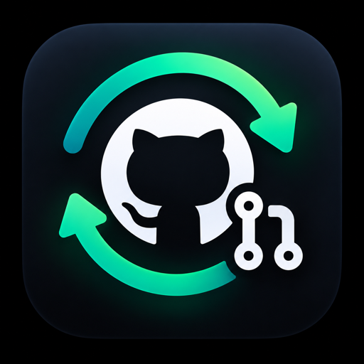

<p align="center">
  
</p>

<h1 align="center">gh-pr-watcher</h1>

<p align="center">
  Mantiene al día tus PRs abiertos y te avisa cuando uno entra en conflicto.<br>
  Una extensión de <a href="https://cli.github.com">GitHub CLI</a> que corre sola unas veces por día.
</p>

<p align="center"><a href="README.md">English</a> · <b>Español</b></p>

---

Hace lo mismo que el botón **"Update branch"** de GitHub, pero por vos y en todos tus PRs a la vez.
No hace falta cambiar nada en el repo: ni Actions, ni bots, ni permisos nuevos. Nunca resuelve
conflictos, no hace rebase ni fuerza nada: cuando un PR entra en conflicto, solo te avisa.

Pensado para repos con la regla *"Require branches to be up to date before merging"*: cada merge a
la base deja atrasados a todos los PRs abiertos, y hay que actualizarlos uno por uno antes de mergear.

<p align="center">
  
</p>

## Instalar

```bash
gh extension install ezeed/gh-pr-watcher
gh pr-watcher install          # te pregunta la config y programa la corrida
gh pr-watcher run --dry-run    # prueba: informa qué haría, sin actualizar ninguna rama
```

### Con un agente

Pedíselo a tu agente de código (Claude Code, Codex, Cursor…):

```text
Instalá gh-pr-watcher siguiendo https://github.com/ezeed/gh-pr-watcher/blob/main/AGENTS.md
```

Lee tus cuentas, orgs y repos con `detect` e instala con flags, sin preguntas por consola:

```bash
gh pr-watcher detect
gh pr-watcher install --owners "AcmeCorp" --every 1h
```

### Requisitos

- **macOS** para la programación automática (launchd). En Linux, `run` funciona igual e `install`
  te da la línea para `crontab`.
- [`gh`](https://cli.github.com) autenticado (`gh auth login`), con permiso de escritura sobre la
  rama de cada PR. Con tus PRs en el repo de la org ya lo tenés. Desde un fork, el PR necesita
  *"Allow edits from maintainers"*.
- `jq` (`brew install jq`).
- Opcional: `terminal-notifier` (`brew install terminal-notifier`), para que el click en la
  notificación abra el PR. Sin él, las notificaciones salen por `osascript` y sin click.

## Configuración

Vive en `~/.config/gh-pr-watcher/config`. Son líneas `KEY=VALUE` que se leen sin ejecutarse. Los
cambios valen desde la próxima vuelta; solo `EVERY_MINUTES` necesita `gh pr-watcher install --yes`
para reprogramar.

| Clave | Default | Qué controla |
|---|---|---|
| `GH_USER` | *(vacío)* | Cuenta de `gh` a usar, aunque la activa sea otra. Vacío = la cuenta activa de `gh` en cada corrida. |
| `OWNERS` | *(vacío)* | Orgs o usuarios cuyos repos se vigilan, separados por espacio. Vacío = todos tus PRs abiertos, en cualquier repo. El instalador propone tus orgs. |
| `REPOS` | *(vacío)* | Repos puntuales `owner/repo`, separados por espacio. Si hay alguno, se vigilan **solo esos** y `OWNERS` no cuenta (la búsqueda de GitHub combina org y repo con Y, no con O). |
| `EVERY_MINUTES` | `60` | Cada cuántos minutos corre: `15`, `30`, `60`, `120` o `180`, contando desde las 0 hs (`180` = 0, 3, 6… hs). Si la máquina está dormida a esa hora, launchd corre la vuelta al despertar. Cada actualización dispara el CI, así que un intervalo más corto puede sumar corridas de CI cuando entran varios merges seguidos. Una config con el viejo `EVERY_HOURS` sigue andando hasta el próximo `install`. |
| `INCLUDE_DRAFTS` | `false` | `true` = también actualiza los drafts. |
| `SKIP_LABEL` | *(vacío)* | Los PRs con esta etiqueta no se tocan. El instalador ofrece `no-autoupdate`; en el archivo podés poner cualquiera. |
| `NOTIFY_IMAGE` | *(el logo)* | Imagen local (PNG o JPG) que va a la derecha de la notificación. Solo con `terminal-notifier`. El ícono de la izquierda no se puede cambiar: macOS lo toma de la app que notifica. |

Una clave mal escrita (`OWNER=`) o una línea que no es `KEY=VALUE` no se ignora en silencio: se
avisa, con una sugerencia si se parece a una clave real. `install` además verifica que cada owner
y cada repo existan y que tu cuenta los vea.

El log y el estado quedan en `~/.local/state/gh-pr-watcher/`. Mientras un PR siga en conflicto,
te lo recuerda como mucho una vez por hora (en el momento si aparece uno nuevo o cambia la lista): una sola notificación para todos, que abre el PR si hay uno o una
página local con la lista si hay varios. El estado solo recuerda desde cuándo está abierto cada
conflicto: borrarlo es inocuo. Cada log guarda sus últimas 2000 líneas (de días a un mes, según la frecuencia y
cuántos PRs haya abiertos); las anteriores se descartan en cada vuelta.

## Comandos

| Comando | Qué hace |
|---|---|
| `install [opciones]` | Guarda la config y programa la corrida (launchd en macOS; en Linux imprime la línea de `crontab`). Sin opciones y con terminal, pregunta. |
| `run [--dry-run]` | Corre una vuelta ahora. Con `--dry-run` informa qué haría, sin actualizar ramas, sin notificar y sin guardar estado. |
| `status [--json]` | Config, si el agente está cargado, la última vuelta, el último error y el final del log. |
| `doctor [--json]` | Revisa todo lo que hace falta para que una vuelta ande y dice cómo arreglar cada problema. No cambia nada. |
| `log [N]` | Las últimas N líneas del log (30 por default). |
| `config` | La ruta y el contenido del archivo de config. |
| `test-notify` | Manda una notificación de prueba. |
| `detect [--user LOGIN]` | JSON con cuentas, orgs, repos con PRs tuyos, dependencias, config e instalación actual. Es para agentes. |
| `uninstall` | Quita la programación. La config y el log quedan. |
| `version` · `help` | Versión y ayuda. |

Un comando mal escrito sugiere el correcto (`rub` → `run`). Los errores salen por stderr con el
prefijo `error:` y un código de salida distinto de 0. Los mensajes de la herramienta están en inglés.

### Opciones de `install`

Con cualquiera de estas opciones (salvo `--dry-run`), `install` no pregunta nada: las opciones
pisan la config que ya tenías y lo que falte sale de los defaults.

| Opción | Qué hace |
|---|---|
| `--user LOGIN` | Cuenta de `gh` a usar (`GH_USER`). |
| `--owners "A B"` | Orgs o usuarios a vigilar (`OWNERS`). `""` = todos tus PRs. |
| `--repos "o/r o/r"` | Solo estos repos (`REPOS`); reemplaza a `--owners`. |
| `--every 15m\|30m\|1h\|2h\|3h` | Cada cuánto corre (`EVERY_MINUTES`). `--every-hours 1\|2\|3` sigue andando. |
| `--drafts` · `--no-drafts` | Actualiza o no los drafts (`INCLUDE_DRAFTS`). |
| `--skip-label L` · `--no-skip-label` | Excluye o no los PRs con la etiqueta L (`SKIP_LABEL`). |
| `--notify-image PATH` | Imagen de las notificaciones (`NOTIFY_IMAGE`). `""` = el logo. |
| `--yes` | No pregunta: usa la config existente y los defaults. Sirve para reprogramar después de editar el archivo. |
| `--dry-run` | Muestra la config y el LaunchAgent que escribiría, sin tocar nada. Sola, igual hace las preguntas. |

## Si algo no anda

```bash
gh pr-watcher doctor
```

Marca cada problema con el comando que lo arregla y termina con código distinto de 0 si algo
falla. No cambia nada ni manda notificaciones. Revisa:

- `gh` y `jq` instalados, y `terminal-notifier` (solo como aviso).
- La config: claves mal escritas y valores inválidos.
- La sesión de `gh`, el permiso `repo`, y que cada owner y repo exista y tu cuenta lo vea.
- La programación: que el LaunchAgent esté cargado, que apunte a un `gh` que todavía existe (brew a
  veces lo mueve) y que su programación coincida con `EVERY_MINUTES`.
- **Que haya corrido.** Es lo único que ninguna notificación avisa: si launchd deja de disparar, no
  hay error. `doctor` compara la última vuelta con la última hora programada; si la máquina estaba
  apagada a esa hora no lo marca, y si estaba dormida espera a que launchd la corra al despertar.
- Otro watcher corriendo a la vez, el último error de una vuelta y un estado dañado.

`doctor --json` devuelve lo mismo para un agente: `{ok, checks: [{id, status, message, fix}]}`.

## Actualizar y desinstalar

```bash
gh extension upgrade pr-watcher     # la programación sigue andando, no hace falta reinstalar
gh pr-watcher uninstall && gh extension remove pr-watcher
```

`uninstall` deja la config y el log; para empezar de cero, borrá también `~/.config/gh-pr-watcher`
y `~/.local/state/gh-pr-watcher`.

## Licencia

[MIT](LICENSE).
